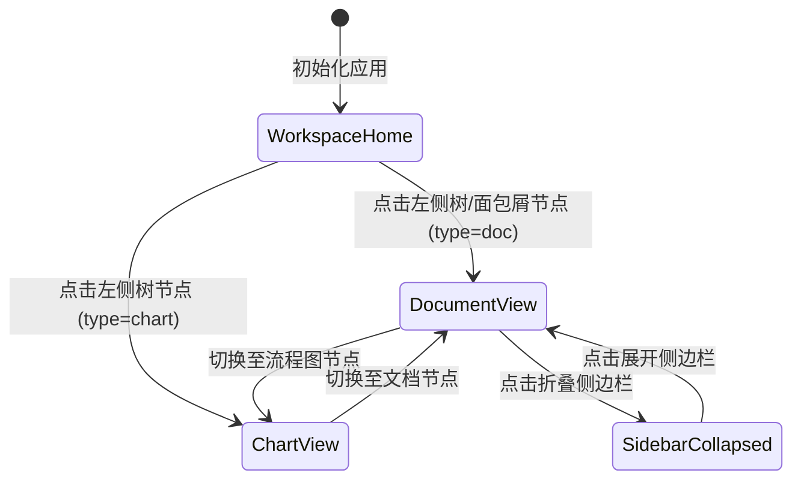

# Phase 1 Data Model: 前端系统总布局规划

**Feature Branch**: `001-frontend-main-layout`
**Date**: 2026-08-16
**Spec**: [spec.md](spec.md)

## Entities & Interfaces

### 1. NavNode (导航与知识库树节点)

表示左侧侧边栏导航和知识库目录树中的基本节点项。

```typescript
export type NodeType = 'doc' | 'folder' | 'chart' | 'link';

export interface NavNode {
  /** 节点唯一标识符 */
  id: string;
  /** 节点名称/文档标题 */
  title: string;
  /** 节点类型 */
  type: NodeType;
  /** 图标类型或图标名称 */
  icon?: string;
  /** 父节点 ID (根节点为 null 或 undefined) */
  parentId?: string | null;
  /** 子节点列表 (仅文件夹或知识库根有效) */
  children?: NavNode[];
  /** 是否已被置顶 */
  isPinned?: boolean;
  /** 是否已被收藏 */
  isFavorite?: boolean;
  /** 作者信息 */
  author?: {
    name: string;
    avatarUrl?: string;
  };
  /** 最后修改时间描述 */
  updatedAt?: string;
  /** 文档初始内容或引用的关联数据 */
  content?: string;
}
```

### 2. BreadcrumbItem (动态面包屑节点)

用于顶部栏展示完整上下文脉络的面包屑项。

```typescript
export interface BreadcrumbItem {
  id: string;
  label: string;
  type: NodeType;
  isLast: boolean;
  nodeRef: NavNode;
}
```

### 3. LayoutState & Context (布局全局状态)

用于控制总布局显隐、主题与选中的节点状态。

```typescript
export interface LayoutState {
  /** 侧边栏折叠状态 (true: 收起为 64px 图标栏, false: 展开 260px) */
  isSidebarCollapsed: boolean;
  /** 是否显示右侧大纲浮窗 */
  isOutlineOpen: boolean;
  /** 当前选中的导航节点 ID */
  activeNodeId: string;
  /** 当前主题模式 */
  theme: 'light' | 'dark';
  /** 侧边栏可收起/展开的分类展开状态集合 */
  expandedNodeIds: Record<string, boolean>;
}
```

## State Transitions


