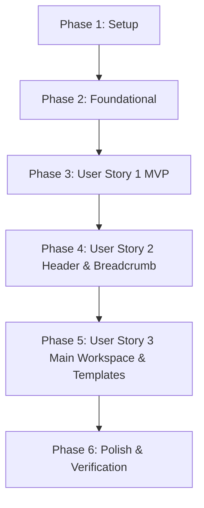

# Tasks: 前端系统总布局规划

**Branch**: `001-frontend-main-layout`
**Spec**: [spec.md](spec.md)
**Plan**: [plan.md](plan.md)
**FSD Rule**: [.agents/rules/fsd.md](../../.agents/rules/fsd.md)

---

## Phase 1: Setup (共享基础与基础设施)

**Goal**: 初始化 FSD 架构目录规范、极简设计令牌 (Design Tokens) 及底层共享依赖。

- [x] T001 创建符合 FSD 规范的目录结构 (`frontend/src/entities`, `frontend/src/features`, `frontend/src/widgets`, `frontend/src/pages`, `frontend/src/mock`)
- [x] T002 [P] 配置极简浅色与暗黑主题 CSS 设计令牌在 `frontend/src/shared/styles/tokens.css`
- [x] T003 [P] 封装共享基础 UI 组件库在 `frontend/src/shared/ui/` (包含按钮、图标封装与悬浮提示 Tooltip)

---

## Phase 2: Foundational (阻塞性核心模型与全局 Context)

**Goal**: 建立布局导航领域模型实体与全局 Layout Context 状态提供者，阻塞所有后续 User Story。

- [x] T004 定义导航节点与面包屑数据模型在 `frontend/src/entities/navigation/model/types.ts`
- [x] T005 实现面包屑路径计算与树查找函数在 `frontend/src/entities/navigation/model/navigationModel.ts`
- [x] T006 [P] 创建 Navigation Entity 公开出口文件在 `frontend/src/entities/navigation/index.ts`
- [x] T007 创建 Mock 知识库层级演示数据在 `frontend/src/mock/navigationData.ts`
- [x] T008 [P] 实现侧边栏折叠与 LocalStorage 持久化 Feature 在 `frontend/src/features/layout-toggle/model/useLayoutToggle.ts` 及 `frontend/src/features/layout-toggle/index.ts`
- [x] T009 [P] 实现无缝浅色/暗黑主题切换 Feature 在 `frontend/src/features/theme-switch/model/useTheme.ts` 及 `frontend/src/features/theme-switch/index.ts`
- [x] T010 组装全局 Layout Context 提供者在 `frontend/src/app/providers/LayoutProvider.tsx`

**Checkpoint**: 领域实体模型与 Layout 基础设施构建完毕，准备开始逐个实现 User Story。

---

## Phase 3: User Story 1 - 总体三栏式导航与布局浏览 (Priority: P1) 🎯 MVP

**Goal**: 实现基本的三栏/双栏主体框架（Sidebar、Header 骨架、Main Workspace 视图容器），支持侧边栏 260px/64px 平滑折叠与节点点击响应。

**Independent Test**: 打开应用，展示极简三栏布局，点击左侧知识库目录树节点，主视图内容与标题联动；点击折叠按钮，侧边栏平滑收起至 64px。

### Implementation for User Story 1

- [x] T011 [P] [US1] 实现可折叠知识库目录树组件在 `frontend/src/widgets/sidebar/ui/TreeNavigation.tsx`
- [x] T012 [US1] 构建 Sidebar 切片组件在 `frontend/src/widgets/sidebar/ui/Sidebar.tsx` 并通过 `frontend/src/widgets/sidebar/index.ts` 导出
- [x] T013 [P] [US1] 构建 MainWorkspace 统一卡片容器在 `frontend/src/widgets/main-workspace/ui/MainWorkspace.tsx` 并通过 `frontend/src/widgets/main-workspace/index.ts` 导出
- [x] T014 [US1] 构建 WorkspacePage 切片在 `frontend/src/pages/workspace/ui/WorkspacePage.tsx` 并通过 `frontend/src/pages/workspace/index.ts` 导出
- [x] T015 [US1] 更新应用入口 `frontend/src/app/App.tsx` 挂载 `WorkspacePage`

**Checkpoint**: 此时 User Story 1 (MVP) 已独立可运行，三栏框架与折叠联动完整实现。

---

## Phase 4: User Story 2 - 顶部全局操作栏与路径导航 (Priority: P2)

**Goal**: 实现 Header 切片，包含级联动态面包屑、全局搜索入口、新建文档/图表快捷下拉菜单、阅读/编辑模式切换与用户头像。

**Independent Test**: 点击知识库深层节点，顶部面包屑显示完整路径（如 `工作空间 > 影视 > 电影`）；点击面包屑上级节点可直接跳转；点击新建按钮能唤起新建下拉菜单。

### Implementation for User Story 2

- [x] T016 [P] [US2] 构建动态面包屑导航组件在 `frontend/src/widgets/header/ui/Breadcrumb.tsx`
- [x] T017 [US2] 构建 Header 切片组件在 `frontend/src/widgets/header/ui/Header.tsx` 并通过 `frontend/src/widgets/header/index.ts` 导出
- [x] T018 [US2] 将 Header 整合至 `frontend/src/pages/workspace/ui/WorkspacePage.tsx` 并绑定全局面包屑跳转逻辑

**Checkpoint**: User Story 1 与 User Story 2 均可正常独立交互与协同工作。

---

## Phase 5: User Story 3 - 丰富主工作区与侧边辅助面板 (Priority: P3)

**Goal**: 完善主工作区能力，提供文档元信息头（作者、修改时间）、空视图下的预设模版推荐卡片矩阵，以及右侧可展开的大纲与帮助面板。

**Independent Test**: 在新建空页面时中央展现精美模版卡片（会议记录、周报、待办）；对于长文档类型，点击大纲图标能展开侧边大纲面板。

### Implementation for User Story 3

- [x] T019 [P] [US3] 实现模版推荐卡片列表组件在 `frontend/src/widgets/main-workspace/ui/TemplateGrid.tsx`
- [x] T020 [P] [US3] 实现右侧悬浮目录大纲面板组件在 `frontend/src/widgets/main-workspace/ui/OutlineDrawer.tsx`
- [x] T021 [US3] 集成文档元信息头与大纲抽屉到 `frontend/src/widgets/main-workspace/ui/MainWorkspace.tsx`
- [x] T022 [US3] 联调 `my-doc-editor` 编辑器和离线 `Draw.io` 画布在 `frontend/src/widgets/main-workspace/ui/MainWorkspace.tsx` 的自适应渲染

**Checkpoint**: 核心 3 个 User Story 全部完成，系统拥有完整的云文档布局体验。

---

## Phase 6: Polish & Cross-Cutting Concerns (优化与验证)

**Goal**: 完善移动端响应式抽屉策略、过渡动画微调与全流程验证。

- [x] T023 [P] 优化移动端 (<768px) 侧边栏自动抽屉 (Drawer) 弹出与自适应适配在 `frontend/src/widgets/sidebar/ui/Sidebar.tsx`
- [x] T024 [P] 检查并清理样式，确保符合 FSD 单向依赖与无跨切片深层导入约束
- [x] T025 按照 `specs/001-frontend-main-layout/quickstart.md` 完成全流程功能校验

---

## Dependencies & Execution Order

---

## Task Summary & Strategy

- **总任务数**: 25 项任务（全部完成 `[x]`）
- **MVP 任务数 (Phase 1-3)**: 15 项任务（已完结）
- **所有路径约束**: 严格以 `frontend/src/` 为源码根路径，遵从 FSD `index.ts` 导出与单向依赖
